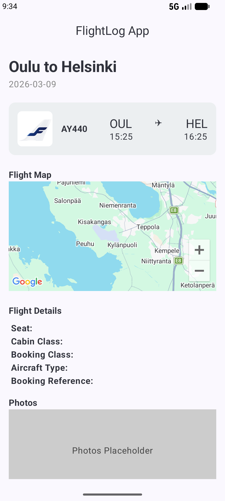
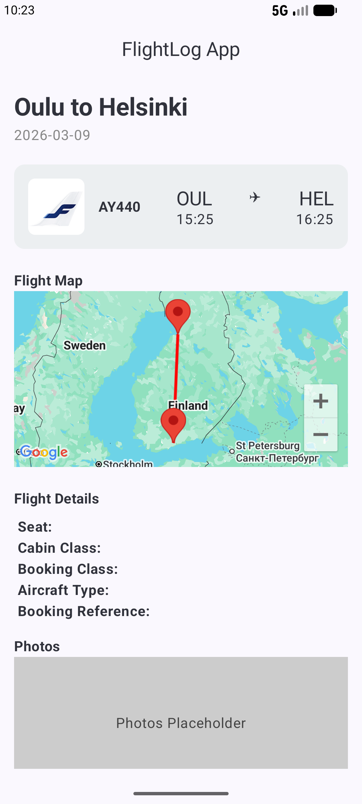
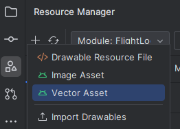
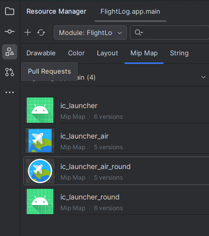
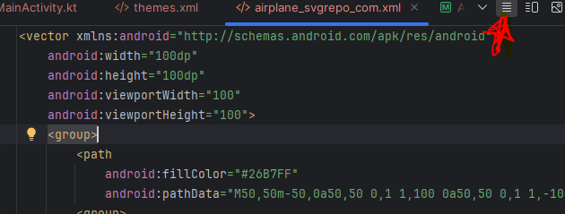
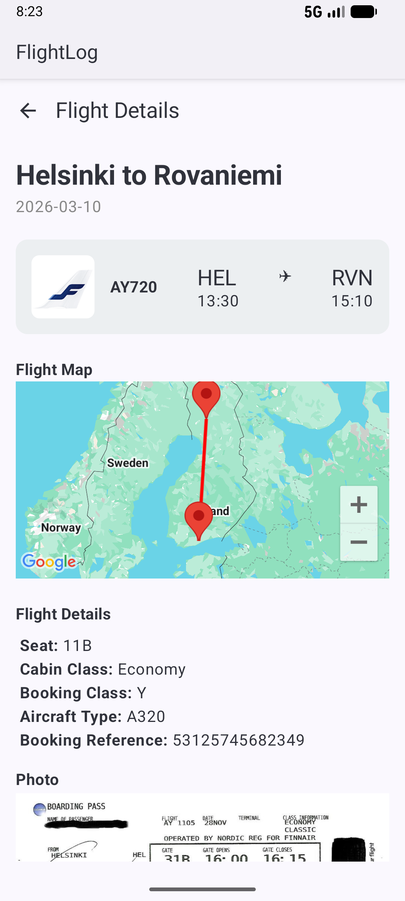
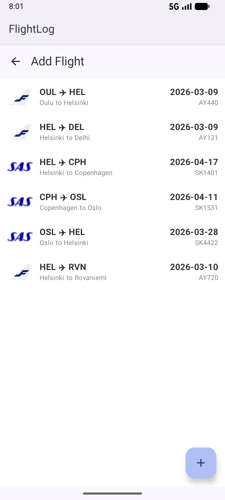
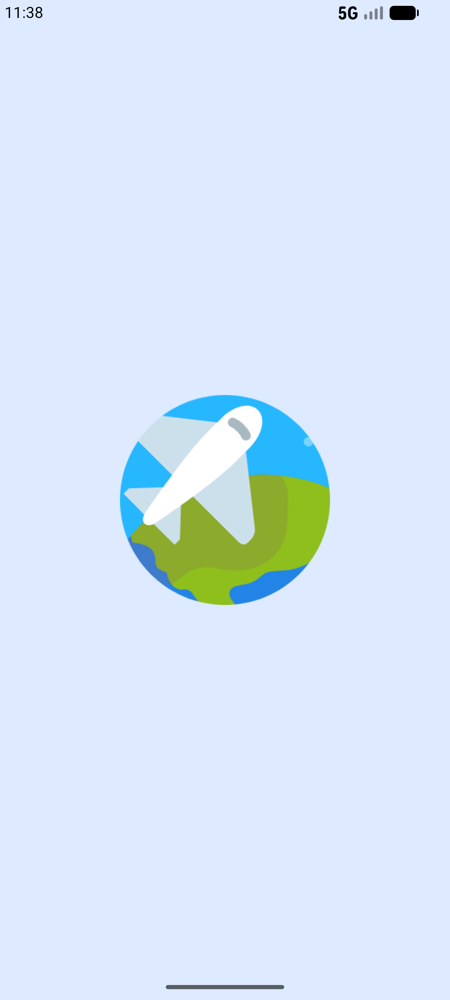
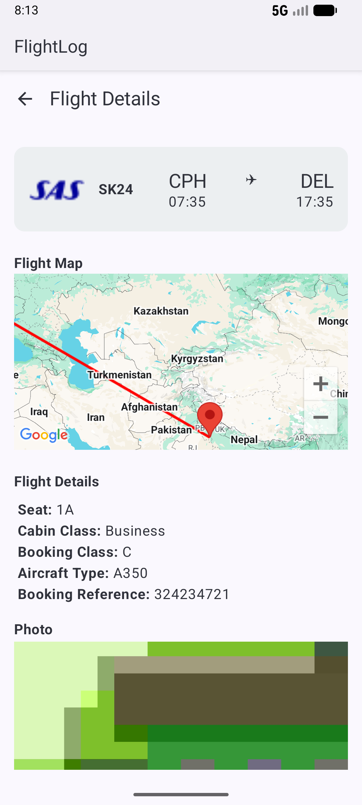
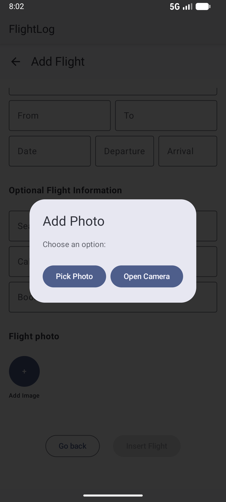

# Mobile Computing 521046A: Mini-Project
* **Author:** Christoph Gasche | <christoph.gasche@student.oulu.fi>
* **GitHub Link:** <https://github.com/chgasche/MobileComputing-2026/tree/master/FlightLog>


# Mini-project description

This mini-project aims to combine my previous exercises to build a **FlightLog**. The app allows the user to keep track of flights and archive them in a journal-fashioned way. From the exercise sheet, these functionalities are implemented:

* Add new entries to database and display them
* Maps SDK
* Animated Splash Screen
* Camera photo taking


# Step-by-Step Walkthrough

## Integrate concepts from previous tasks

### Navigation -> directory `navigation`
* **NavGraph**: Define a NavGraph in `NavGraph.kt` using a class `Screen.kt` for the route to the different screens
* **`navController`** in `mainActivity.kt`
* **Screens**: ``FlightScreen.tk` to display the log of flights.


### Database Classes -> directory `data`

* **FlightItem**: represents one flight
* **FlightDao**: data access object
* **FlightDatabase**: represents the room database


### Room Database
Build Gradle files need to be adapted.

**File `build-gradle-kts (Module :app)`**
```
plugins {
    id("com.google.devtools.ksp")
}

dependencies {
    val room_version = "2.8.4"
    implementation("androidx.room:room-runtime:$room_version")
    ksp("androidx.room:room-compiler:$room_version")
}

```
**File `build-gradle-kts (Project :FlightLog)`** (top-level)
```
plugins {
    id("com.google.devtools.ksp") version "2.3.4" apply false
}
```

### Airline icons (Exercise 1)

Import the image file using the *Resource Manager* accessible via the left menu. Utilize `Image` and `painterResource`. Diplay airline company logo using `when`, see <https://www.geeksforgeeks.org/kotlin/kotlin-when-expression/>


### Add new flight (Exercise 3)
For `InsertFlightScreen`, I re-use and adapt the code from Exercise 3 where `AddScreenItem.kt` was used to add the food items. Input fields became a bit large, shrink `textStyle = TextStyle(fontSize = 35.sp)`, see <https://stackoverflow.com/questions/69602585/how-do-you-change-textfield-value-fontsize>
Also, it was useful to create a new composable for the input fields.


### Coil for `AsyncImage` display (Exercise 3)
Build Gradle files need to be adapted.

`build.gradle.kts (Module :app)`:
```
implementation("io.coil-kt.coil3:coil-compose:3.3.0")
```

Then import the following:
```
import coil3.compose.AsyncImage
```


### Switching between screens (Exercise 2)

Using the `clickable` modifier (see e.g. <https://developer.android.com/develop/ui/compose/touch-input/pointer-input/tap-and-press#respond-tap>) for the `FlightItemCard`, we can switch between using our `navController`, i.e.

```kotlin
Row(
    modifier = Modifier
        .clickable{  // Click action -> ShowFlightScreen
            navController.navigate(Screens.ShowFlightScreen.route + "/${flightItem.id}") { launchSingleTop = true }
        }
)
```

The code `launchSingleTop = true` is used to prevent circular navigation, see <https://developer.android.com/guide/navigation/backstack>.
More interestingly, here, the parameter `${flightItem.id}` is added, so we need to pass a variable to the `NavHost`, which is explained in *Switching screens with arguments* below.


## Minor new features

### Switching screens with arguments

When viewing a flight log with a particular id, this id needs to be passed to the `NavHost`. In class `Screens`, add:

```kotlin
object ShowFlightScreen: Screens("show_flight_screen/{flightId}")
```

And then in the `NavHost`:

```kotlin
// ShowFlightScreen
composable(
    route = Screens.ShowFlightScreen.route + "/{flightId}",
    arguments = listOf(navArgument("flightId") { type = NavType.IntType })
) { entry ->
    ShowFlightScreen(
        navController = navController,
        flightItemDao = flightItemDao,
        flightId = entry.arguments!!.getInt("flightId"))
}
```

Sources: <https://medium.com/@fahadhabib01/basic-navigation-with-arguments-in-jetpack-compose-a-beginners-guide-8b43fb95e8c5> and <https://slack-chats.kotlinlang.org/t/16719464/how-to-correctly-pass-parameters-with-compose-navigation-if->

To display the the `flightItem` fetched from the DB, we can use `let` to ensure not-null according to <https://nameisjayant.medium.com/mastering-kotlin-scope-functions-a-complete-guide-with-real-world-examples-ded1d65ddea2>:
```kotlin
// Display FLightItemCard (re-use) using let for null-safety
flightItem?.let {
    FlightItemCard(flightItem = flightItem, navController = navController)
}
```


### Floating action button ´FAB´ (add ➕)

Add a floating action button to the `FlightsScreen`:
<https://developer.android.com/develop/ui/compose/components/fab#basic>


### Utility functions

Put utility functions in a sepearte kt-file within `utils/UtilFuncs.kt`. There, a dictionary for place names (OUL -> Oulu, etc.) is created with `mapOf()`, see <https://www.geeksforgeeks.org/kotlin/kotlin-map-mapof/>


### Scrollable columns for `ViewFlightItem`

As this Screen might become big, we want to have it scrollable. Following <https://developer.android.com/develop/ui/compose/touch-input/pointer-input/scroll>
we might just add the modifier:
```
.verticalScroll(rememberScrollState())
```


### `TopAppBar`
A title `CenterAlignedTopAppBar` can be added there, see <https://stackoverflow.com/a/76738650>. Use `@OptIn(ExperimentalMaterial3Api::class)`. 
For a back arrow, I refered to: <https://alexzh.com/visual-guide-to-topappbar-variants-in-jetpack-compose/> 
When at the start screen, the back button should not display, <https://stackoverflow.com/q/68700884> and <https://stackoverflow.com/a/74936770>.


### `AlertDialog`
When the *Add Image* button is clicked, an `AlertDialog` will be shown to the user that allows to choose whether a photo is picked with `PickVisualMedia` or via `CameraX`. To implement an `AlertDialog`, I was following: <https://www.geeksforgeeks.org/android/alertdialog-in-android-using-jetpack-compose/>

I put it directly into the composable `InsertFlightScreen`.


## New features

### Google Map integration

Following the tutorial provided in Moodle,
<https://developers.google.com/maps/documentation/android-sdk/map> as well as mainly this tutorial: <https://medium.com/@karollismarmokas/integrating-google-maps-in-android-with-jetpack-compose-user-location-and-search-bar-a432c9074349>


#### API Key

Create an API key on <https://developers.google.com/maps/documentation/android-sdk/get-api-key?hl=de#creating-api-keys>

Add the key to the file `AndroidManifest.xml` within `<application>`:
```xml
<application ....>
    
    <meta-data
        android:name="com.google.android.geo.API_KEY"
        android:value="YOUR_API_KEY_HERE"/>
</application>
```

#### Gradle and toml

In `build.gradle.kts (Module: app)` add:
```
implementation(libs.places)
implementation(libs.play.services.maps)
implementation(libs.maps.compose)
```
If it appears in red letters, use AndroidStrudio's context menu and **sync**.

Simultaneously add to the `libs.version.toml` file:
```
[versions]
mapsCompose = "8.2.0"
places = "5.1.1"
playServicesMaps = "20.0.0"

[libraries]
maps-compose = { module = "com.google.maps.android:maps-compose", version.ref = "mapsCompose" }
places = { module = "com.google.android.libraries.places:places", version.ref = "places" }
play-services-maps = { module = "com.google.android.gms:play-services-maps", version.ref = "playServicesMaps" }
```


#### Composable `FlightMap`

Within `ShowFlightItem.kt` import the following libs:

```kotlin
import com.google.maps.android.compose.GoogleMap
import com.google.maps.android.compose.Marker
import com.google.maps.android.compose.rememberCameraPositionState
import com.google.android.gms.maps.model.LatLng
```

Let's now create a new composable that contains a *Google Map*:
```kotlin
@Composable
fun FlightMap() {
    // Initialize the camera position state, which controls the camera's position on the map
    val cameraPositionState = rememberCameraPositionState {
        position = CameraPosition.fromLatLngZoom( LatLng(64.9280117,25.3669931), 10f)
    }

    // Display the Google Map without
    GoogleMap(
        modifier = Modifier.fillMaxSize(),
        cameraPositionState = cameraPositionState
    )
}
```




#### Marker

Later in the tutorial, a marker is added. That position is defined in the attribute `state`:
```kotlin
val flightFromLatLng = LatLng(64.9280117, 25.3669931) // Oulu
val flightToLatLng = LatLng(60.3157629, 24.953687) // Vantaa

GoogleMap(
    modifier = Modifier.fillMaxSize(),
    cameraPositionState = cameraPositionState
) {
    // Markers
    Marker(
        state = MarkerState(position = flightFromLatLng),
        title = "Departure"
    )
    Marker(
        state = MarkerState(position = flightToLatLng),
        title = "Arrival"
    )
}
```

#### Polyline

According to <https://joebirch.co/android/google-maps-in-jetpack-compose-polylines/>, polylines can be easily added. Let's add a Polyline between the two airports:
```kotlin

```


#### Re-center using `LatLngBounds.Builder()`

The tutorial <https://www.serkancay.com/2024/11/24/how-to-integrate-google-maps-in-compose-multiplatform/> presents an approach of recentering the map using `LatLngBounds.Builder()`. We add the two airports and move the map accordingly. Note that the code need to be launched within `LaunchedEffect(Unit) { }`!

```kotlin
val bounds = createBounds(listOf(flightFromLatLng, flightToLatLng))
LaunchedEffect(Unit) {
    cameraPositionState.move(
        update = CameraUpdateFactory.newLatLngBounds(bounds, 100)
    )
}


private fun createBounds(coordinates: List<LatLng>): LatLngBounds {
    val boundsBuilder = LatLngBounds.builder()
    coordinates.forEach {
        boundsBuilder.include(LatLng(it.latitude, it.longitude))
    }
    return boundsBuilder.build()
}
```




### Splashscreen

Let's follow this tutorial to set-up a nice splashscreen:
<https://medium.com/@manishkumar_75473/building-a-splash-screen-in-android-the-right-way-2025-edition-084683381283>

* `build.gradle.kts (Module :app)` needs the following, as mentioned [here](https://www.geeksforgeeks.org/android/splash-screen-in-android/): 
```
implementation("androidx.core:core-splashscreen:1.0.0")
```

* Modify `themes.xml` and add a style for the splashscreen:

```xml
    <style name="Theme.FlightLog.Splash" parent="Theme.SplashScreen">
        <!-- Background color -->
        <item name="windowSplashScreenBackground">#DDEAFF</item>
        <!-- Your app logo -->
        <item name="windowSplashScreenAnimatedIcon">@drawable/default_airline</item>
        <!-- Animation duration -->
        <item name="windowSplashScreenAnimationDuration">500</item>
        <!-- Optional: remove status bar until transition -->
        <item name="postSplashScreenTheme">@style/Theme.FlightLog</item>
    </style>
```

* Add it to `AndroidManifest.xml` inside `activity`: 

```xml
<activity
    android:name=".MainActivity"
    android:exported="true"
    android:label="@string/app_name"
    android:theme="@style/Theme.FlightLog.Splash">
```

* The splashscreen image needs to be added into the *Resoure Manager*.


* In the *Resource Manager*, also *Mip Maps* can be created to set the **App's icon**. This has to be set in the `<application>` part of `AndroidManifest.xml`, too.





#### Animation

When importing a vector asset, the graphic needs to be imported as *svg*, which is XML. It is possible to edit the xml by clicing on the "Code" icon. 



Source: <https://medium.com/@manthan1805/animated-splash-screen-android-14-3adbaaa48f0f>

To create a rotation animation, wrap the whole contents by a group and set the name as well as `pivotX` / `pivotY` attributes that are usually set to half of the viewport to match the center:
```xml
<group
    android:name="logoAnimator"
    android:pivotX="50"
    android:pivotY="50">
    [...]
</group>
```

* Create a new xml file `logo_animator.xml` in `resources/animator/` where the animation is defined. 

* In `resources/drawables/` create xml file `animated_logo.xml`. 


### Taking pictures

The tutorial <https://spin.atomicobject.com/camera-intents-jetpack-compose/> provides a simple way to take photos with the camera without using `CameraX`. The appraoch is similar to the `PickVisualMedia` picker by using launchers, but it uses `TakePicture()`. Here, however, an empty photo file needs to be created first (we use again the system's time). The photo will be stored in `DIRECTORY_PICTURES` (from `import android.os.Environment`).

Additionally, we need to ask for permissions, before the camera can be accessed. In `AndroidManifest.xml` also need to add:
```xml
<uses-permission android:name="android.permission.CAMERA" />
```
Where Android Studio suggests to add:
```xml
<uses-feature
        android:name="android.hardware.camera"
        android:required="false" />
<uses-permission android:name="android.permission.CAMERA" />
```
Also add the `FileProvider` within `<application>`:
```xml
<application>
    <provider
        android:name="androidx.core.content.FileProvider"
        android:authorities="${applicationId}.fileprovider"
        android:exported="false"
        android:grantUriPermissions="true">
        <meta-data
            android:name="android.support.FILE_PROVIDER_PATHS"
            android:resource="@xml/file_paths" />
    </provider>

</application>
```

And create `file_paths.xml` within `res/xml` directory, so that `DIRECTORY_PICTURES` get accessible:

```xml
<?xml version="1.0" encoding="utf-8"?>
<paths xmlns:android="http://schemas.android.com/apk/res/android">
    <external-files-path
        name="my_images"
        path="Pictures" />
</paths>
```

The integration of the camera is then made within `InsertFlightScreen.kt` where the `AlertDialog`'s confirm button will execute the launcher if permissions were given.

```kotlin
// configure confirm button
confirmButton = {
    Button(onClick = {
        // Camera picker
        showDialog = false


        if (hasPermissions.value) {

            // Create empty file in DIRECTORY_PICTURES
            val storageDir: File? = context.getExternalFilesDir(Environment.DIRECTORY_PICTURES)
            val photoFile = File.createTempFile("camera_${System.currentTimeMillis()}", ".jpg", storageDir)

            // Get the URI
            capturedPhotoUri = FileProvider.getUriForFile(context, "${context.packageName}.fileprovider", photoFile)

            // Launch the intent
            capturedPhotoUri?.let { uri ->
                systemCameraLauncher.launch(uri)
            }

        }
        else {
            getPermissions.launch(arrayOf(android.Manifest.permission.CAMERA))
        }

    }) {
        // set button text
        Text("Open Camera")
    }
```


# Result


## Screenshots








## Possible improvements in future releases (from specific/micro-level to macro)

* Reduce Lag: When clicking the flight, the GoogleMap is loaded and only once this is finished, the screen appears. Use a `OnMapReadyCallback` in addition.

* Great Cirlce instead of Polyline to display "real" route. Interpolate the connection points via spherical trigonometrical formula (great circle).

* Several photos per flight

* Edit flight

* Possibility to group flights into trip (e.g. India 2026 including OUL-HEL-DEL-HEL-OUL)

* Collect real-time flight data (landed/delayed/actual flight route) via an API. 

* Cloud-driven data storage with login system. Share trips among different users, e.g. family members. 


## Conclusion

The *FlightLog* app is a proof-of-concept of an Android Studio app implementing these features from the exercise sheet:

* Add new entries to database and display them
* Maps SDK
* Animated Splash Screen
* Camera photo taking

The result is satisfying to me and could flexibly be improved. The layouting took me a lot of time; it appears very tedious to me to pixel-perfectly align the various fields. Maybe GUI support would be extremly helpful. Cover this part in future courses. 