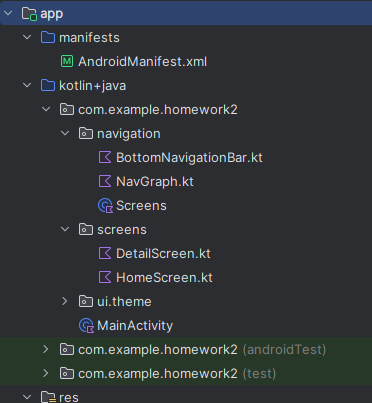

# Mobile Computing 521046A: Exercise 2
* **Author:** Christoph Gasche | <christoph.gasche@student.oulu.fi>
* **GitHub Link:** <https://github.com/chgasche/MobileComputing-2026/tree/master/Homework2>

## Description of the task

The task of this week was to enrich the Android app with "navigation". 

## Sources

[Android Developers](https://developer.android.com/guide/navigation) provides the manual/reference for the navigation component. It's clearly very technical and moreover, the introductory [Codelab](https://developer.android.com/codelabs/android-navigation#0) is unfortunately deprecated. I felt lost. 

To get a more comprehensible and beginner-friendly guide, I was following a tutorial by *Jess Barrientos* [Jetpack Compose: Navigation tutorial](https://dev.to/jbc7ag/jetpack-compose-navigation-tutorial-9en)

* <https://dev.to/jbc7ag/jetpack-compose-navigation-tutorial-9en>
* <https://developer.android.com/guide/navigation>


## Modularization

The tutorial modularizes the app into several files:


* **`screens/HomeScreen.tk`** and **`screens/DetailsScreen.tk`** contain the composables (UI) for two views.
* **`navigation/NavGraph.tk`** contains the `NavHost` that defines the routes to the screens
* **`navigation/Screens.tk`** is a so called sealed class whose subclasses contain the route string. No, no raw strings need to be used. 
* **`navigation/BottomNavigationBar.tk`** (created later on) contains the navigation bar at the bottom.
* **`MainActivity.tk`** is the entry point to the application that instanciates the NavController

## Setting up the files

### Screens `screens/HomeScreen.tk` and `screens/DetailsScreen.tk`
These *screens* contain the composables (as seen last week). Adding a button can be achieved e.g. by:
```
Button(
    onClick = {
        navController.navigate(Screens.Detail.route)
    }
) {
    Text(
        text = "Go to Details"
    )
}
```
Notice that a `navController` is required. It will be passed as an argument to the function `HomeScreen` and `DetailsScreen`. The signatures are then:
```
@Composable
fun HomeScreen(navController: NavController) { ... }

@Composable
fun DetailsScreen(navController: NavController) { ... }
```
The function `navigate()` takes advantage of the sealed class `Screens`.


### Class `navigation/Screens.tk`

This class contains the routes to the views. They need to be represented as strings, so this class does the work for that. 
```
sealed class Screens(val route: String) {
    object Home: Screens("home_screen")
    object Detail: Screens("detail_screen")
}
```

### `NavGraph.tk`
Here, our `NavHost` is created and the action of the available routes are set.
```
@Composable
fun NavGraph(navController: NavHostController){
    NavHost(
        navController = navController,
        startDestination = Screens.Home.route
    )
    {
        composable(route = Screens.Home.route) {
            HomeScreen(navController)
        }
        composable(route = Screens.Detail.route) {
            DetailScreen(navController)
        }
    }
}
```

### `MainActivity.tk`
The `NavGraph` needs to be instanciated within the function `onCreate` in the file `MainActivity.tk`
```
val navController = rememberNavController()
NavGraph(navController = navController)
```

### `build.gradle.kts` (Module :app)
Also in accordance with the [official documentation](https://developer.android.com/jetpack/androidx/releases/navigation#declaring_dependencies) at least one dependency needs to be added to the file `build.gradle.kts` (Module :app):
```
    val nav_version = "2.9.6"
    implementation("androidx.navigation:navigation-compose:${nav_version}")
```


## Intermediate Result
After the tutorial, the app has two screens and it able to switch between them. Clicking the OS-back button ◀ will go back one step, but the naviation remains circular.


## Circular Navigation 
As proposed in the homework tipps, the function `popUpTo()` could benefit. This is described on the page 
[Circular Navigation](https://developer.android.com/guide/navigation/backstack/circular#compose-implementation).
So, basically `popUpTo()` has to be added where the button `onClick` is handled:
```
Button(
    onClick = {
        navController.navigate(Screens.Detail.route){
            popUpTo(Screens.Detail.route) { inclusive = true }
        }
    }
) { ... }
```


## Navigation bar

A navigation bar at the bottom of Android apps is pretty common. I follow these two resources to create one:

* Android Developers: [Navigation Bar](https://developer.android.com/develop/ui/compose/components/navigation-bar#example:-top) as well as their sample [code](https://github.com/android/snippets/blob/b534c181d84f21a4e21cd04a8529e78dacc7e46f/compose/snippets/src/main/java/com/example/compose/snippets/components/Navigation.kt#L123).

* Santosh Yadav: [Bottom Navigation Bar in Jetpack Compose](https://medium.com/@santosh_yadav321/bottom-navigation-bar-in-jetpack-compose-5b3c5f2cea9b)

### Scaffold and modifiers

To use a navigation bar, it's advisable to switch from `Surface` to `Scaffold`. In order to get paddings work correctly, *modifiers* need to be propagated to composables as well as the `AppNavHost`, so we need to change function signatures. 
```
NavGraph(navController = navController, modifier = Modifier.padding(contentPadding))
```


### Creating navigation bar `navigation/BottomNavigationBar.kt`

Let's create a file `BottomNavigationBar.kt` containing the function to create the navigation bar. Follow the tutorial and adapt the code in its [repository](https://github.com/santosh5432/BottomBar_Navigation/blob/master/app/src/main/java/com/learningroots/bottombar/BottomNavigationBar.kt) 

Now, the function is called in the `Scaffold` that was created in `MainActivity.tk`:
```
Scaffold(
        modifier = Modifier
            .fillMaxSize(),
        bottomBar = { BottomNavigationBar(navController) }
    ) { innerPadding -> ... }
```

**Remark** (*Circular Navigation*): The `onClick` function within `BottomNavigationBar.kt` needs to be fixed using `popUpTo()` as described above.


### Icons

Android's *Material* provides a some icons, see [here](https://fonts.google.com/icons). Certain `imports` are required to use them:
```
import androidx.compose.material.icons.Icons
import androidx.compose.material.icons.filled.Home
import androidx.compose.material.icons.filled.Info
```

#### Local state in navigation bottom bar

One remaining bug is that clicking the buttons on the screens does not change the bottom navigation bar. This is because the navigation bar uses a local state variable:
```
val selectedNavigationIndex = rememberSaveable {
    mutableIntStateOf(0)
}
```
We might want to query the current route of the navController and use it to activate the icons. As presented in this [tutorial](https://medium.com/@KaushalVasava/navigation-in-jetpack-compose-full-guide-beginner-to-advanced-950c1133740#af88), the above val is replaced by:
```
val navBackStackEntry by navController.currentBackStackEntryAsState()
val currentDestination = navBackStackEntry?.destination
```
And later the `selected` state is set via:
```
selected = currentDestination?.hierarchy?.any { it.route == screen.route } == true,
```

## Conclusion

A simple navigation was integrated in the app. My approach consisted of mixing diverse tutorial contents together, which worked surprisingly well. It would have been appreciated in the lectures to get some more overview over these concepts and guided info on how to start programming towards this result.