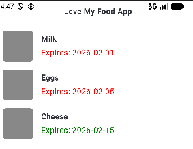
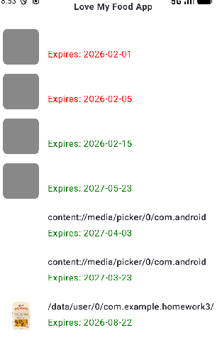
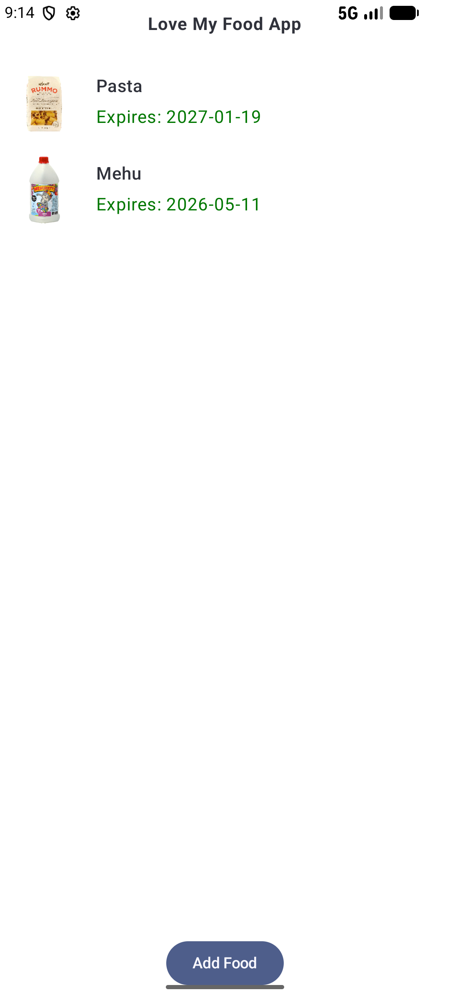
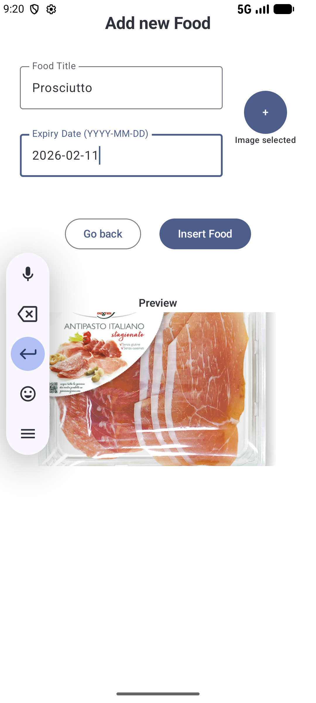
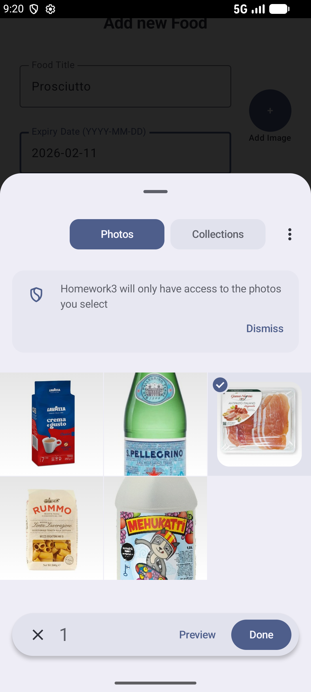

# Mobile Computing 521046A: Exercise 3
* **Author:** Christoph Gasche | <christoph.gasche@student.oulu.fi>
* **GitHub Link:** <https://github.com/chgasche/MobileComputing-2026/tree/master/Homework3>

## Description of the task

My goal is to build a simple app to reduce food waste. The user can add food items including the expiry date. In the main screen, a list sorted by expiry data is presented. Also, a photo of the product is shown. The second screen allows the user to add a product and pick a photo. 

## Sources

* Anand Gaur: *Room Database in Android*. <https://medium.com/@anandgaur2207/room-database-in-android-d5f279d4648a>
* Android Developers: *Save data in a local database using Room*. <https://developer.android.com/training/data-storage/room>
* <https://manpreet.fyi/posts/room-kmp-post/>
* <https://medium.com/@daniel.atitienei/picking-images-from-gallery-using-jetpack-compose-a18c11d93e12#0fd4>
* <https://developer.android.com/develop/ui/compose/side-effects>
* <https://developer.android.com/training/data-storage/app-specific#internal-access-files>


## NavHost (Recap Week 2)

As two screens are involved, a NavHost as in the previous exercise is required. For that:

* In the project tab, create a new package `navigation` under `com.example.homework3`. Add a new kt-file `NavGraph.tk` and a class `Screen`.

* In a new package/folder `screens`, create the screens `HomeScreen.kt` and `AddItem.kt`.

* In the `MainActivity` add the `NavGraph` and remember to `import com.example.homework3.navigation.NavGraph`:

* If `navigation` still appears in red color, because the dependency might be missing. This can be fixed automatically by *Android Studio* in the context menu (Alt+Enter) and selecting *add dependency on `androidx.navigation:navigation-compose` and import*. This will automatically add an extry into the file `libs.versions.toml` and fix the problem.


Then, the app should start and replicate the same setup as in the previous week.


## Room Database

Let's create local database access using [Room Database](https://developer.android.com/training/data-storage/room). I follow the [tutorial](https://medium.com/@anandgaur2207/room-database-in-android-d5f279d4648a) by Anand Gaur as well as the official guide.


### Setting up `Room`

As described in <https://developer.android.com/training/data-storage/room#setup> and <https://developer.android.com/build/migrate-to-ksp#add-ksp>, the files `build-gradle-kts (Module :app)` and `build-gradle-kts (Project :Homework3)` need to be adjusted:

**File `build-gradle-kts (Module :app)`**
```
plugins {
    id("com.google.devtools.ksp")
}

dependencies {
    val room_version = "2.8.4"
    implementation("androidx.room:room-runtime:$room_version")
    ksp("androidx.room:room-compiler:$room_version")
}

```
**File `build-gradle-kts (Project :Homework3)`** (top-level)
```
plugins {
    id("com.google.devtools.ksp") version "2.3.4" apply false
}
```


### Entity class `FoodItem`, DAO `FoodItemDao` and database class `FoodItemDatabase`

* `FoodItem` holds the entities and defines their attributes in the database.
* `FoodItemDao` (Data Access Object) provides the functions to interact with the database. Holds the SQL queries provided to the app.
* `FoodItemDatabase` represents the whole database.


### Instanciate the database

The database is intergrated in the `MainActivity.tk` via:
```
val db = Room.databaseBuilder(
    applicationContext,
    FoodItemDatabase::class.java, "fooditem"
).build()
val foodItemDao = db.foodItemDao()
val foodItems: List<FoodItem> = foodItemDao.getAll()
```

### Schema exportation

The warning *Schema export directory was not provided to the annotation processor* might occur. One possibility is to disable schema export by setting `exportSchema = false` in the `FoodItemDatabase` constructor, see <https://stackoverflow.com/questions/44322178/room-schema-export-directory-is-not-provided-to-the-annotation-processor-so-we>.


## HomeScreen

Let's now get into designing the composables. As in the first homework project, I will use composables as in Week 1's exercise. For the single items, a `FoodItemCard` is created that consists of a picture and the food name as well as the expiry date. The color of the expiry date will be determined upon the current system time. For that, `SimpleDateFormat` and ` System.currentTimeMillis()` are compared, see <https://mkyong.com/java/java-how-to-get-current-date-time-date-and-calender/> and <https://developer.android.com/reference/android/icu/text/SimpleDateFormat>. To determine the color, I use a `when` conditional, as seen here: <https://developer.android.com/codelabs/basic-android-kotlin-compose-conditionals#2>

The `FoodItemList` with the `FoodItemCards` will show up between the headline and the buttom. To take up the whole available space, the modifier `.weight(1f)` can be used, see <https://medium.com/@dhivyakgf/spacers-and-margins-in-jetpack-compose-handling-space-like-a-pro-236a988f8f38>.


## Accessing the data

The database in instanciated in the `MainActivity.tk` and a DAO is created (singleton). In order to access the data, we need to pass the DAO through `NavGraph` down to the `HomeScreen`. Let's thus add a new argument into `NavGraph`:

```
Scaffold(modifier = Modifier.fillMaxSize()) { contentPadding ->
    NavGraph(
        navController = navController,
        foodItemDao = foodItemDao,   // <-- pass DAO here
        modifier = Modifier.padding(contentPadding)
    )
}
```


### Using `Flow`

The app kept shutting down. As done in this [tutorial](https://manpreet.fyi/posts/room-kmp-post/#database-setup), the DAO can be modified using `Flow` from `import kotlinx.coroutines.flow.Flow`
```
	// import kotlinx.coroutines.flow.Flow

    // OLD
    @Query("SELECT * FROM fooditem")
    fun getAll(): List<FoodItem>

    // NEW
    @Query("SELECT * FROM fooditem")
    fun getAllFlow(): Flow<List<FoodItem>>
```


## Sample Data

Let's insert some sample data in the `MainActivity`. For that, the function `insert()` of the DAO is used. It turned out, that the app crashed. As done in the [tutorial](https://manpreet.fyi/posts/room-kmp-post/#ui-setup), the function `insert()` can be set to `suspend`. Then, at the place where it is called, it needs to be surrounded by `LaunchedEffect(Unit) { }`. Alternatively, `scope.launch{ }` as described [here](https://developer.android.com/develop/ui/compose/side-effects) or [here](https://medium.com/@paul_thommithazhe/understanding-kotlin-coroutines-and-suspend-a-beginner-friendly-guide-931f417d0ab6).

In `MainActivity.tk`:
```
import androidx.compose.runtime.LaunchedEffect

// Insert sample data
LaunchedEffect(Unit) {
    insertSampleData(foodItemDao)
}

suspend fun insertSampleData(foodItemDao: FoodItemDao) {
    foodItemDao.insert(
        FoodItem(title = "Milk", expiryDate = "2026-02-01", imagePath = "")
    )
    foodItemDao.insert(
        FoodItem(title = "Eggs", expiryDate = "2026-02-05", imagePath = "")
    )
    foodItemDao.insert(
        FoodItem(title = "Cheese", expiryDate = "2026-02-15", imagePath = "")
    )
}
```

In `FoodItemDao.tk`:
```
    @Insert
    suspend fun insert(foodItem: FoodItem)
```

To finally display the sample data, the DAO can be accessed in `MainScreen` using `collectAsState()` as done in the [tutorial](https://manpreet.fyi/posts/room-kmp-post/#ui-setup). This additional step is needed when `Flow` is used.

```
import androidx.compose.runtime.getValue
import androidx.compose.runtime.collectAsState

val foodItems by foodItemDao.getAll().collectAsState(initial = emptyList())
FoodItemList(foodItems)
```




## Layouting the screen `AddFoodItem` and adding a File Picker

Let's now design the UI of the second screen, where a new item can be added. Here, text fields are in use. I follow the code from <https://developer.android.com/develop/ui/compose/text/user-input?textfield=value-based#choose-textfield> where `remember { mutableStateOf("Hello") }` is used to allow access to its value. Also some nice buttons are added, <https://developer.android.com/develop/ui/compose/components/button>.

For the **photo picker**, I refer to the provided link on Android developers: <https://developer.android.com/training/data-storage/shared/photo-picker#compose>

`PickVisualMedia` should be imported via:
```
import androidx.activity.result.contract.ActivityResultContracts.PickVisualMedia
```

The function `rememberLauncherForActivityResult` is used to get the URI of the selected media. In order to store it to a variable, the syntax `mutableStateOf<Uri?>(null)` needs to be used, as I discovered in <https://medium.com/@daniel.atitienei/picking-images-from-gallery-using-jetpack-compose-a18c11d93e12#0fd4>.
```
    var textImageURI by remember { mutableStateOf<Uri?>(null) }

    val pickMedia = rememberLauncherForActivityResult(PickVisualMedia()) { uri ->
        // Callback is invoked after the user selects a media item or closes the photo picker.
        if (uri != null) {
            textImageURI = uri
        }
    }
```


The caption should change from "Add Image" to "Image selected". This is done via:
```
text = if (textImageURI == null) "Add Image" else "Image selected"
```
Also, there should be some minimal input validation. I disable the button when the input is not altered:
```

```


## Insert Food

To insert new items into the database, I create a supsend function `insertFoodItem()` within `AddFoodItem.kt`. As seen earlier, the *suspend* function needs to be exectued in a scope:
```
val scope = rememberCoroutineScope()
scope.launch {
    // Pass to DAO and insert into DB
    insertFoodItem(
        dao = foodItemDao,
        title = textItemTitle,
        expiryDate = textItemExpiryDate,
        imageUri = textImageURI
    )
    // Navigate back
    navController.navigate(Screens.Home.route){
        popUpTo(Screens.Home.route) { inclusive = true }
    }
}
```


## Image display

Image display can be done using `AsyncImage` and [Coil](https://coil-kt.github.io/coil/compose/). First, the dependency has to be added to the file `build.gradle.kts (Module :app)`:
```
implementation("io.coil-kt.coil3:coil-compose:3.3.0")
```

After a *Gradle Sync*, e.g. clicking on *File >> Sync Project with Gradle Files*, the following import of `coil3` (note the **`3`**) is possible:
```
import coil3.compose.AsyncImage
```

An `AsyncImage` can be added using the following code where an image preview is added to the `AddFoodItem` screen:
```
textImageURI?.let { uri ->
    Column(
        horizontalAlignment = Alignment.CenterHorizontally,
        modifier = Modifier.padding(top = 16.dp)
    ) {
        Text(
            text = "Preview",
            style = MaterialTheme.typography.bodyMedium,
            fontWeight = FontWeight.SemiBold
        )

        Spacer(modifier = Modifier.height(2.dp))

        AsyncImage(
            model = uri,
            contentDescription = "",
            modifier = Modifier
                .fillMaxWidth()
                .heightIn(max = 200.dp),
            contentScale = ContentScale.Crop
        )
    }
}
```
Likewise, the `AsyncImage` can be implemented in the `MainScreen`.


## Image persistency

Now, the images are shown, however, when the app is restarted, they disappear again. This is because the temporary file handles to the picker files are revoked. 



So, we want to copy the images to the app internal storage as highlighted in the Exercise sheet tips:

* <https://developer.android.com/training/data-storage/shared/media#open-file-stream>
* <https://developer.android.com/training/data-storage/app-specific#internal-access-files>

I create a function `saveImageToInternalStorage()` that is called inside `insertFoodItem()`, i.e.  when the button is clicked. An `openInputStream()` is established and later saved via `copyTo()` as found [here](https://stackoverflow.com/questions/76587418/how-save-an-image-from-gallery-to-internal-memory-using-jetpack-compose). This depends on the context which is passed as an argument. As a filename I take the current systemtime in millis to be on the safe side. It seems to be non-straightforward to obtain the file-extension of the picked media file. Hence, I restrict the MIME type to `image/jpeg` and always use the file extension `.jpg`. 


## Conclusion

An android app with `Room` database access was created. A file picker was added and the images were displayed as `AsyncImages` using `Coil`. In obtain persistency, the picked images were moved to the app internal storage. 

The robustness of the app is limited since there are only few integrity checks. The design could be improved, e.g. arranging the files also as a grid and enabling another screen with food item details (where modification/deletion is possible, too). Also, notification of nearly expiring foods could be helpful.


## Screenshots





