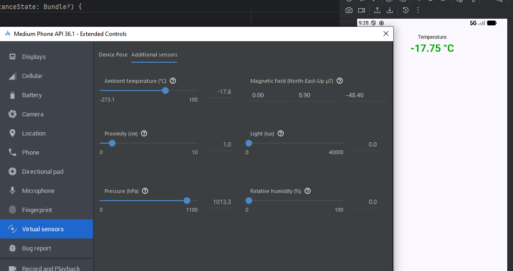
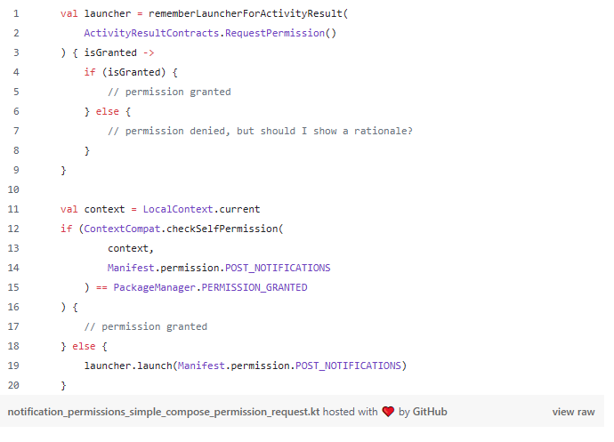
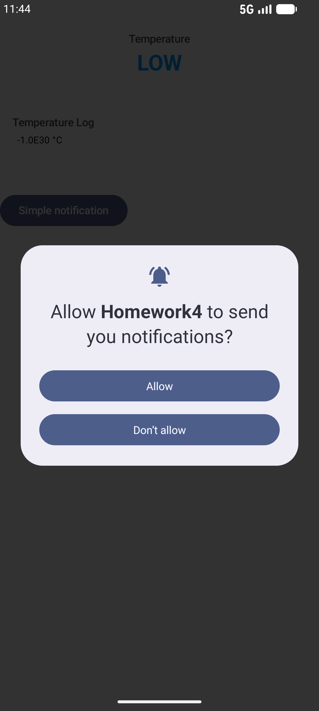
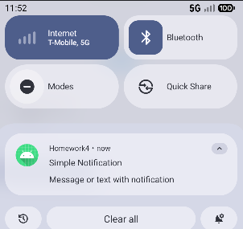
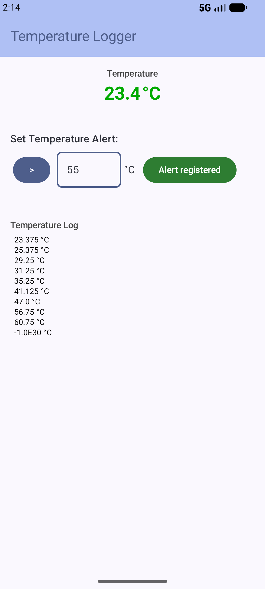
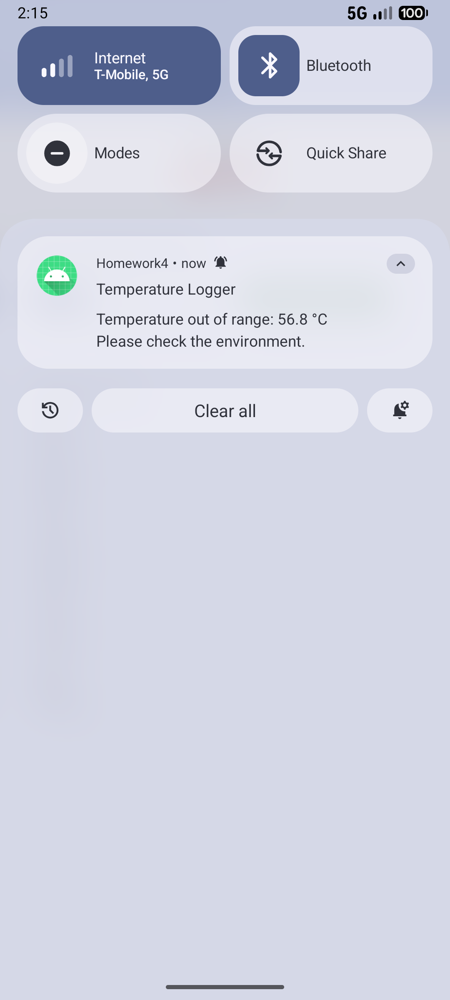

# Mobile Computing 521046A: Exercise 4
* **Author:** Christoph Gasche | <christoph.gasche@student.oulu.fi>
* **GitHub Link:** <https://github.com/chgasche/MobileComputing-2026/tree/master/Homework4>

## Description of the task

## Sources

* Sensor Handling
	* <https://www.geeksforgeeks.org/kotlin/android-proximity-sensor-using-kotlin/>
	* <https://www.geeksforgeeks.org/kotlin/proximity-sensor-in-android-app-using-jetpack-compose/>
	* <https://www.vogella.com/tutorials/AndroidSensor/article.html>

* Notifications
	* <https://meetpatadia9.medium.com/local-notification-in-android-with-jetpack-compose-437b430710f3>
	* <https://developer.android.com/develop/ui/views/notifications/build-notification#tap>
	
* Permission:
	* <https://kubiakdev.medium.com/notification-permission-request-on-android-13-part-2-the-implementation-f512239a9bc#3f69>

* Composables
	* Dropdown: <https://developer.android.com/develop/ui/compose/components/menu#create-basic>
	* TopBar: <https://developer.android.com/develop/ui/compose/components/app-bars#small>
	* State Hoisting: <https://developer.android.com/develop/ui/compose/state#state-hoisting>
	* State Hoisting: <https://stackoverflow.com/questions/70958029/preview-in-jetpack-compose-with-lambda-function-doesnt-work>


## Sensor

To get access to the sensor data, I followed the three tutorials stated above. Key steps within `MainActivity.tk`:

**Declare Variables**: Before `onCreate()` declare these *variables*:
```kotlin
lateinit var sensorManager: SensorManager
var temperatureSensor: Sensor? = null
private var temperatureState = mutableStateOf("No DATA")
```
The variables contain the references to an instance of `SensorManager`, an actual `Sensor` whose value will be stored in `temperatureState` for access by the composable. 

**Instanciate Variables**: In the `onCreate()` method of `MainActivity` we instanciate `sensorManager` and one `temperatureSensor` of type **`Sensor.TYPE_AMBIENT_TEMPERATURE`**:
```kotlin
sensorManager = getSystemService(SENSOR_SERVICE) as SensorManager
temperatureSensor = sensorManager.getDefaultSensor(Sensor.TYPE_AMBIENT_TEMPERATURE)
if (temperatureSensor == null) {
    temperatureState.value = "No SENSOR"
}
else {
    sensorManager.registerListener(
        temperatureSensorEventListener,
        temperatureSensor,
        SensorManager.SENSOR_DELAY_NORMAL
    )
}
```
Also, a `SensorEventListener` is created which will propagate updates on `temperatureSensor`

**Event Listener**: The event listener is now defined and we indicate what to do when the temperature sensor is updated:
```kotlin
private val temperatureSensorEventListener: SensorEventListener = object : SensorEventListener {
    override fun onAccuracyChanged(sensor: Sensor?, accuracy: Int) {
    }

    override fun onSensorChanged(event: SensorEvent) {
        val temp = event.values[0]
        temperatureState.value = "$temp"
    }
}
```

**Unregister listener**: When the app destructor is called, the listener should be unregistered:
```kotlin
override fun onDestroy() {
    super.onDestroy()
    if (temperatureSensor != null) {
        sensorManager.unregisterListener(temperatureSensorEventListener)
    }
}
```

**Composables**: A text field is now able to render the temperature value (that is stored in `temperatureState`):
```kotlin
Text(
    text =  "$temperatureString °C",
    fontWeight = FontWeight.Bold
)
```

### Note on permissions

**`Sensor.TYPE_AMBIENT_TEMPERATURE`** does not require permissions to be set in the `manifest` file!

### Emulating sensors
The emulator in AndroidStudio is capable to emulate sensors. For that, the icon (⋮) is called which opens *Extended Controls* where the sensor values can be set, see screenshot:




## Notifications

For the notifications, I was following this [tutorial](https://meetpatadia9.medium.com/local-notification-in-android-with-jetpack-compose-437b430710f3). In `MainActivity.tk` new variables for the `NotificationManager` and `NotificationChannel` are created (outside `onCreate()`):
```kotlin
// Notification Variables
lateinit var notificationChannel: NotificationChannel
lateinit var notificationManager: NotificationManager
lateinit var notificationHandler: NotificationHandler
```
and then instanciated as follows:
```kotlin
// Initialize notification
notificationChannel = NotificationChannel(
    "notification_channel_id",
    "TemperatureLogger Channel",
    NotificationManager.IMPORTANCE_DEFAULT
)
notificationManager = getSystemService(NOTIFICATION_SERVICE) as NotificationManager
notificationManager.createNotificationChannel(notificationChannel)
notificationHandler = NotificationHandler(this)
```

**`NotificationHandler` class** is contained in the file `NotificationHandler.tk` and handles the notification and provides a function `showSimpleNotification()` to display a very basic popup. When the user clicks the notification it automatically dismisses, as set here:
```kotlin
.setAutoCancel(true) // dismiss notification when user clicks
```

**Add Permission `POST_NOTIFICATIONS`**: When the class file was created, Android noticed that `notificationManager.notify()` requires `POST_NOTIFICATIONS` permissions. In the IDE, the `manifest` file can automatically adjusted via quick-fix, which will insert
```xml
<uses-permission android:name="android.permission.POST_NOTIFICATIONS" />
```
into `AndroidManifest.xml`. 😅 


**Button**: The target function to launch a notification when the button is hit is: `notificationHandler.showSimpleNotification()`. However, the notification will not show up until the permissions are requested  and granted.


### Permission Request Dialog 

Let's ask the user for permission to display the notifications. For that, I follow this [tutorial](https://kubiakdev.medium.com/notification-permission-request-on-android-13-part-2-the-implementation-f512239a9bc#3f69) and create a new composable `registerAlertButton` for my button:



After that, a popup shows and asks the user for permissions and finally, my simple notification pops up.





### More complex notification with `setContentIntent()`


The default action is `.setAutoCancel(true)`, which dismisses the notification. If, instead, we want to open the app, we need to use `setContentIntent()` as explained in the [docs](https://developer.android.com/develop/ui/views/notifications/build-notification#tap): 

In `NotificationHandler.kt`:
```kotlin
fun showTemperatureNotification(currentTemp: String) {
    
    val intent = Intent(context, MainActivity::class.java).apply {
        flags = Intent.FLAG_ACTIVITY_NEW_TASK or Intent.FLAG_ACTIVITY_CLEAR_TASK
    }
    
    val pendingIntent: PendingIntent = PendingIntent.getActivity(
        context,
        0,
        intent,
        PendingIntent.FLAG_IMMUTABLE
    )
    
    val notification = NotificationCompat.Builder(context, notificationChannelID)
        .setContentTitle("Temperature Logger")
        .setContentText("Temperature out of range: $currentTemp °C")
        .setStyle(
            NotificationCompat.BigTextStyle()
                .bigText("Temperature out of range: $currentTemp °C\nPlease check the environment.")
        )
        .setSmallIcon(android.R.drawable.ic_dialog_info)
        .setPriority(NotificationCompat.PRIORITY_DEFAULT)
        .setContentIntent(pendingIntent)   // <--------    open app when clicked
        .setAutoCancel(true) // dismiss notification when user clicks
        .build()  // finalizes the creation
    
    notificationManager.notify(Random.nextInt(), notification)
}
```


## Alert Registration System

Let now move towards the possibility to set custom temperature alerts. I designed a new composable `TemperatureAlertForm` that holds the form and uses the previously created button `RegisterAlertButton`.

To implement the alert system:

1. Create new variables in the `MainActivity`:
```kotlin
private var alertOperator by mutableStateOf(">")
private var alertThreshold by mutableStateOf(50f)
private var alertRegistered by mutableStateOf(false)
```

2. Extend composable `RegisterAlertButton` by accepting arguments:
```
fun RegisterAlertButton(
    notificationHandler: NotificationHandler,
    selectedOperator: String,
    thresholdText: String,
    alertRegistered: Boolean,
    onAlertRegistered: (String, Float) -> Unit
) { }
```
There is an event `onAlertRegistered()` the requests the change of the alarm parameters. Using the [*State Hoisting*](https://developer.android.com/develop/ui/compose/state?hl=en#state-hoisting) design pattern, when the button is pressed, the whole data is passed from bottom (i.e. button) through all intermediate composables up to MainActivity where the variables `alertOperator`, `alertThreshold`, etc. (see 1.) are changed. 

3. The button text and color change when the alert is registered.

4. In `MainActivity` the `TemperatureWindow` is called via:
```
TemperatureWindow(
    temperatureString = temperatureState.value,
    temperatureLog = temperatureLog.value,
    alertRegistered = alertRegistered,
    onAlertValueChange = { operator, temperature ->
        alertOperator = operator
        alertTemperature = temperature
        alertRegistered = true
        alertTriggered = false
    },
    modifier = Modifier.padding(innerPadding)
)
```

5. Alert handling in `onSensorChanged(event: SensorEvent) { }`: Here, the handling of the alerts is done. When the sensor value is changed, a possible alert is issued and a notification is sent. 


## Conclusion

The app is able to monitor ambient temperature using `Sensor.TYPE_AMBIENT_TEMPERATURE` and `SensorManager`. It implements an alert system that allows to set a threshold temperature and hit the button to activate the alert system. Whenever the temperature is out of range, a notification is issued.

Notifications are pushed using a `NotificationManager` accessing `NotificationChannel` and a self-defined class `NotificationHandler` that provides an appropriate function. A permission request dialog is shown to the user asking for `POST_NOTIFICATIONS` before the alert system can be used. 

When the app is initialized the temperature sensor of the emulator is set to a very low value. In that case, "LOW" is displayed. Then, the value can be changed in the emulator settings. The notifications are sent/received, even when the app is not in foreground. When clicking on the notification the app is sent to foreground. In that case, the status of the app is reset to initial. So, persistency should be implemented in a future release. 

The log is very rudimentary; it would be great to have a graph/chart diagram of the temperature.


